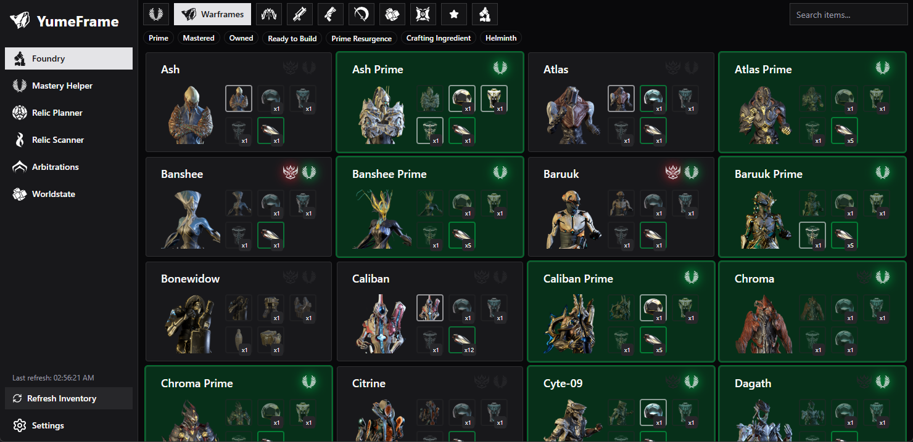

# YumeFrame



YumeFrame is a desktop companion app for Warframe focused on inventory progress, crafting decisions, relic value planning, and worldstate insights.

## Download

- Latest release: https://github.com/Yumeo0/YumeFrame/releases/latest

This URL always redirects to the newest published release/tag.

## Features

- Foundry dashboard with collection filters, mastery progress context, starred goals, and pending recipe tracking.
- Crafting tree and ingredient usage views to plan build paths and dependencies.
- Mastery helper with rank progress and remaining XP breakdown.
- Relic planner with expected platinum/ducat calculations and inventory-aware filters.
- Relic scanner that watches EE.log and resolves reward values from OCR captures.
- Optional full-screen transparent overlay window for relic results.
- Arbitration pages for schedule visibility and session analysis.
- Worldstate page with cycles, fissures, Baro, reset timers, and event widgets.
- Settings sections for relic scanner behavior, auto-refresh intervals, EE.log path detection, and debug tooling.

## Prerequisites

- Bun (recommended package manager/runtime for this repo)
- Node.js (required by Vite/Tauri toolchain)
- Rust toolchain (stable)
- Tauri prerequisites for your OS:
	- https://v2.tauri.app/start/prerequisites/

## Getting Started

Install dependencies:

```bash
bun install
```

Run the web UI only (Vite dev server):

```bash
bun run dev
```

Run the desktop app (Tauri + frontend):

```bash
bun run tauri dev
```

Create a production desktop build:

```bash
bun run tauri build
```

## Useful Scripts

- `bun run dev`: Start Vite dev server
- `bun run build`: Type-check and build frontend
- `bun run preview`: Preview built frontend bundle
- `bun run generate:icons`: Generate Tauri app icons from `public/icon.webp`
- `bun run release:tag`: Create a release tag via `scripts/create-release-tag.ts`

## Warframe Setup Notes

- YumeFrame reads Warframe state from inventory APIs, worldstate endpoints, and EE.log.
- For relic scanner automation, ensure your EE.log path is set correctly in Settings.
- If auto-detection does not find your log file, set it manually via the EE.log Path section.

## Project Structure

- `src/`: React application (pages, hooks, store, utilities)
- `src-tauri/`: Rust/Tauri commands, OCR scanner, native window/overlay handling
- `packages/warframe-worldstate/`: Shared worldstate parser package
- `packages/wfm-api-client/`: Typed API client for warframe.market
- `public/`: Static icons/assets used by the UI

## Data Sources

- Warframe worldstate endpoints (multi-platform)
- Warframe exported content/manifests
- Daily warframe.market price snapshots

## Disclaimer

YumeFrame is a community project and is not affiliated with Digital Extremes.
